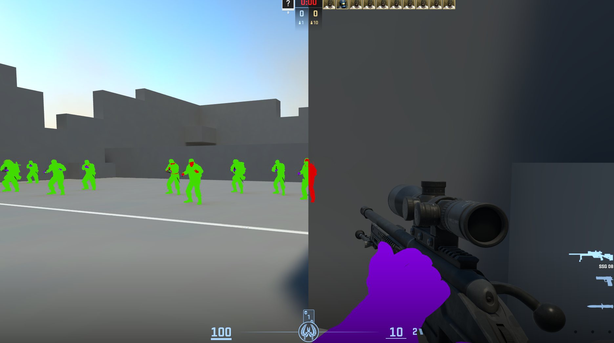

# CS2-DirectX-Chams
A DirectX 11 hook for Counter-Strike 2 that provides customizable chams (wallhack) functionality with color customization and wireframe rendering.

## Features

- **Wallhack**: Render players through walls
- **Chams**: Highlight players and weapons with custom colors
- **Team Chams**: Separate colors for different teams
- **Custom Colors**: 
  - Visible Color (for players in sight)
  - Hidden Color (for players behind walls)
  - Weapons Color (for weapons)
- **Render Modes**: 
  - Default (solid rendering)
  - Wireframe (wireframe rendering)
- **Simple ImGui Menu**: Easy-to-use interface 

## Controls

- **INSERT**: Toggle menu on/off

## Technical Details

- Uses DirectX 11 hooking
- MinHook for function hooking
- Dont need to be updated
- ImGui for user interface
- Real-time shader generation for custom colors

## Usage

1. Inject the DLL into CS2 process
2. Press INSERT to open the menu
3. Enjoy chams

**Disclaimer**: This is for educational purposes only. Use at your own risk.
